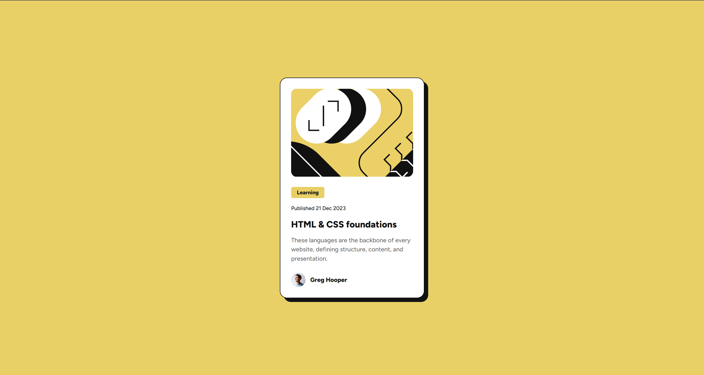
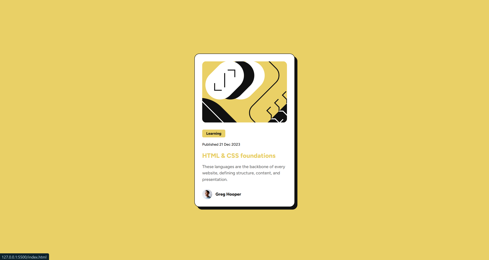

# Frontend Mentor - Blog preview card solution

This is a solution to the [Blog preview card challenge on Frontend Mentor](https://www.frontendmentor.io/challenges/blog-preview-card-ckPaj01IcS). Frontend Mentor challenges help you improve your coding skills by building realistic projects. 

## Table of contents

- [Overview](#overview)
  - [The challenge](#the-challenge)
  - [Screenshot](#screenshot)
  - [Links](#links)
  - [Built with](#built-with)
  - [What I learned](#what-i-learned)
  - [Continued development](#continued-development)
- [Author](#author)

**Note: Delete this note and update the table of contents based on what sections you keep.**

## Overview

### The challenge

Users should be able to:

- See hover and focus states for all interactive elements on the page

### Screenshots



#### Hover state screenshot



### Links

- Solution URL: [](https://github.com/colinven/blog-preview-card)
- Live Site URL: [](https://colinven.github.io/blog-preview-card/)

### Built with

- HTML
- CSS
- Flexbox

### What I learned

Something I learned in this lesson was how to utilize the `@font-face` rule to load my font in my stylesheet. Typically, I link it in the `<head>` of my HTML document, but doing it this way allows me to load it through a local file.

```css
@font-face {
    font-family: Figtree;
    src: url('/assets/fonts/Figtree-VariableFont_wght.ttf') format('truetype')
```

### Continued development

I'd like to continue to learn ways that I can make my CSS more efficient by accomplishing the same task with less code.

## Author

Colin Venancio
